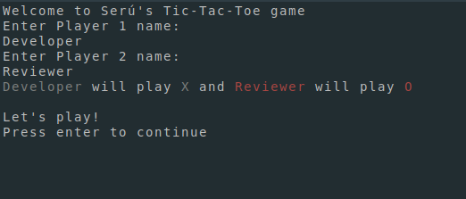
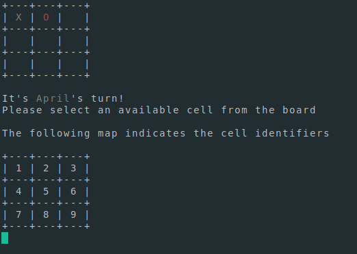
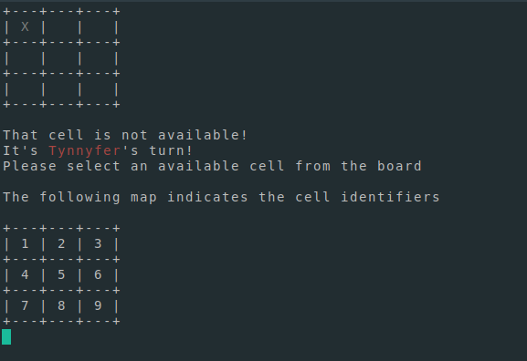
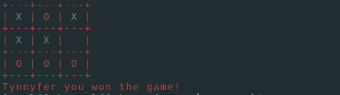

# Tic Tac Toe

This project aims to implement a Tic Tac Toe game with a command line interface using Ruby.

> This project was originally proposed by The Odin Project [link](https://www.theodinproject.com/paths/full-stack-ruby-on-rails/courses/ruby-programming/lessons/tic-tac-toe).

## Built With

- Ruby 3.0.1
- Gems:
  - Bundler
  - RuboCop
  - RSpec
  - Colorize

## Getting Started

**To use the code in this project, you'll need to have Ruby and the gem bundle installed in your computer.**

To get a local copy up and running follow the following simple steps:

On GitHub bash:

- To clone the project to your machine, run `git clone https://github.com/notlfish/TicTacToe.git`
- To enter the project folder, run `cd Tictactoe`.
  To install the required dependencies, run `bundle install`
- To run the game, run `bin/main.rb` in an editor.
- Follow the game rules to play, have fun!

## Playing Tic Tac Toe
Tic Tac Toe is a strategy game between two players

# Game rules
The Tic Tac Toe board is a 3 by 3 grid of cells.

Tic Tac Toe is a turned based game in which each player marks one of the empty cells of the board each turn.

To win the game you have to put three of your marks in a line. It could be three in a row, three in a column, or three in one of the diagonals. The first player to accomplish this wins the game.

If all of the cells are occupied without any of the players winning, the game is a tie.

Example games:
X won with 3 marks in a row
```
+---+---+---+
|   |   |   |
+---+---+---+
| X | X | X |
+---+---+---+
| O | O |   |
+---+---+---+
```

O win with 3 marks in a column
```
+---+---+---+
| O | X |   |
+---+---+---+
| O | X | X |
+---+---+---+
| O |   |   |
+---+---+---+
```

X win with 3 marks in a diagonal
```
+---+---+---+
| X | X |   |
+---+---+---+
| O | X |   |
+---+---+---+
| O | O | X |
+---+---+---+
```

# Playing with this App
To play this app up and running follow the instructions in [Getting Started](#getting-started).
You can exit the game at any point by pressing ```Ctrl C```.

- The game begins with a screen where the players are prompted to input their names.
  - To input a name, write it down with the keyboard and press enter.
  - A player name must begin with a letter, if this condition isn't met, both players will have to input their names again.
  - If an empty name is given, the game will choose a default name for that player
  - After both players have entered their names, an information prompt is written on the screen (See example image below). You have to press enter to begin the game.



- When the game begins player 1 is asked to make a play.
  - To make a play, you have to select one of the free cells in the board.
  - The game board is displayed on top of the screen.
  - You select a cell by inputting it's number.
  - If your input is not the number of a cell, you're asked again to make your play.
  - A map with the number of each cell is displayed in the bottom of the screen.



- After that, the corresponding player is asked to play in each turn.
  - You can only choose free cells to make your move.
  - If you choose an occupied cell, you're asked again to make your play.



- When a player wins, the board turns to that player's color and a congratulatory message is printed.
  - If the game is a tie, the board turns yellow.
  - The configuration of your terminal application may change the coloring of the game.
  - After the game concludes, the application exits.




### Prerequisites

Ruby and Bundler must be installed on your computer (versions 3.0.1 and 2.2.15, respectively)

### Run tests

- RuboCop is set up to run locally. Just run `rubocop` in the root of the repo.
- Additionally, run `bundle install` to install the project's dependencies.
- Finally, run `bundle exec rspec spec/` to perform the provided tests.

## Authors

👤 **Lucas Ferrari Soto**

- GitHub: [@notlfish](https://github.com/notlfish)
- Twitter: [@LucasFerrariSo1](https://twitter.com/LucasFerrariSo1)
- LinkedIn: [LinkedIn](https://www.linkedin.com/in/lucas-mauricio-ferrari-soto-472a3515a/)

## 🤝 Contributing

Contributions, issues, and feature requests are welcome!

Feel free to check the [issues page](https://github.com/notlfish/ruby-bubble-sort/issues).

## Show your support

Give a ⭐️ if you like this project!

## Acknowledgments

This code is a project for [Microverse](https://www.microverse.org/), and its specification was taken from [The Odin Project](https://www.theodinproject.com/home)

## 📝 License

This project is [MIT](./LICENSE) licensed.
